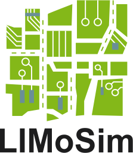

 LIMoSim: Lightweight ICT-centric Mobility Simulation
 ========
 

 **Preliminary Beta Version**

**LIMoSim** is an open source framework for integrated joint simulation of aerial and ground-based vehicular communication networks with an explicit focus on the development of *anticipatory* mobile communication systems. Moreover, it brings together high level mobility simulation with well-known analytical acceleration models.


- [**SETUP INSTRUCTIONS**](INSTALL.md)
- [**ROADMAP**](ROADMAP.md)

A preprint of the **corresponding scientific publication** (IEEE VTC-Fall 2019) is available at: https://arxiv.org/abs/1906.08993. For acknowledging our work in your publication(s), please refer to:
```tex
@InProceedings{Sliwa_etal_2019c,
	Author = {Benjamin Sliwa and Manuel Patchou and Christian Wietfeld},
	Title = {Lightweight simulation of hybrid aerial- and ground-based vehicular communication networks},
	Booktitle = {2019 IEEE 90th Vehicular Technology Conference (VTC-Fall)},
	Year = {2019},
	Address = {Honolulu, Hawaii, USA},
	Month = {Sep},
	Doi = {10.1109/VTCFall.2019.8891340},
}
```

## Quickstart
After following the [setup instructions](INSTALL.md), ...


## Related Publications
- M. Patchou, B. Sliwa, C. Wietfeld, [**Unmanned Aerial Vehicles in Logistics: Efficiency Gains and Communication Performance of Hybrid Combinations of Ground and Aerial Vehicles**](https://arxiv.org/abs/1910.10451), In *IEEE Vehicular Networking Conference (VNC) 2019*, 2019
- B. Sliwa, M. Patchou, C. Wietfeld, [**Lightweight simulation of hybrid aerial- and ground-based vehicular communication networks**](https://arxiv.org/abs/1906.08993), In *IEEE 90th Vehicular Technology Conference (VTC-Fall)*, 2019
- B. Sliwa, S. Falten, C. Wietfeld, [**Performance evaluation and optimization of B.A.T.M.A.N. V routing for aerial and ground-based mobile ad-hoc networks**](https://arxiv.org/pdf/1901.02298.pdf), In *IEEE Vehicular Technology Conference (VTC-Spring)*
- B. Sliwa, T. Liebig, T. Vranken, M. Schreckenberg, C. Wietfeld, [**System-of-systems modeling, analysis and optimization of hybrid vehicular traffic**](https://arxiv.org/abs/1901.03025), In *IEEE International Systems Conference (SysCon)*
- B. Sliwa, C. Wietfeld, [**LIMoSim: A framework for lightweight simulation of vehicular mobility in intelligent transportation systems**](https://www.springer.com/de/book/9783030128418\#aboutBook), In *Springer International Publishing*
- J. Pillmann, B. Sliwa, C. Wietfeld, [**The AutoMat CVIM - A scalable data model for automotive big data marketplaces**](https://arxiv.org/abs/1805.05467), In *IEEE International Conference on Mobile Data Management (MDM)*
- B. Sliwa, J. Pillmann, F. Eckermann, L. Habel, M. Schreckenberg, C. Wietfeld, [**Lightweight joint simulation of vehicular mobility and communication with LIMoSim**](https://arxiv.org/pdf/1710.02966.pdf), In *IEEE Vehicular Networking Conference (VNC)*
- B. Sliwa, J. Pillmann, F. Eckermann, C. Wietfeld, [**LIMoSim: A lightweight and integrated approach for simulating vehicular mobility with OMNeT++**](https://arxiv.org/pdf/1709.02020.pdf), In *OMNeT++ Community Summit 2017 (Best Contribution Award)*
